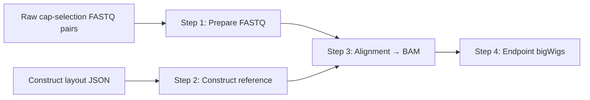

# Cap-selection workflow

This page documents the released **0.1.0b3** `cap-assay-pipeline` stage graph,
handoffs, and how it differs from the nine-step [reporter-assay workflow](../workflow.md).

## Two pipelines in one distribution

Installing the `reporter-assay-pipeline` Python package registers **four**
executables. Three (`yulab_reporter_pipe`, `yulab_reporter_qc`,
`yulab_reporter_export`) implement the **reporter-assay** path from paired-end
QUASARR-seq libraries to element-level activity calls. The fourth,
`cap-assay-pipeline`, implements the **cap-selection** path from cap-selected
cDNA sequencing to strand-selected RNA endpoint bigWig tracks.

The assays share plasmid construct context in the lab, but the command
namespaces, layout schemas, intermediate tables, and final deliverables are
not interchangeable. Reporter-assay Step 4 merges PreTran orientation counts;
cap-selection Step 4 consumes a library BAM and emits strand-selected
bigWigs (four tracks for `both`, two for `plus`/`minus`). Do not
mix step numbers or artifact names across the two workflows.

## Fork–join topology

Cap-selection processing has four resumable steps with a fork after workflow
inputs:

| Leg | Step command | Role |
| --- | --- | --- |
| Read preparation | `step1-prep-fastq` | Adapter trim, 12-base R1 UMI in read names, fastp read filtering (`fastp`; UMI-aware dedup in Step 4) |
| Reference | `step2-build-reference` | Construct-derived FASTA for alignment (independent of Step 1) |
| Join | `step3-alignment` | STAR alignment to the Step 2 reference; coordinate-sorted BAM + BAI |
| Endpoint | `step4-post-alignment-processing` | Pair filtering and strand-selected signed bigWig tracks + summary |

Step 1 and Step 2 are **independent** prerequisites. Step 2 does not read Step 1
output. A construct reference may be reused across libraries. Step 3 joins
prepared reads with that reference. Step 4 accepts **only** a compatible BAM; it
does not require Step 1–3 provenance files if the BAM satisfies the Step 4
admission contract.

There is no grouped whole-pipeline command: run each step explicitly with
compatible artifacts. See [Steps 1–3 handoffs](steps-1-3.md) and the
[Cap-selection CLI](../cli/cap-assay.md) for command names, typical paths, and
the Step 4 reference.

## Step 3 → Step 4 handoff

The logical handoff is **BAM only** (not SAM, CRAM, or ad hoc tables). A
successful Step 3 invocation publishes, under `--output-dir`:

- `{prefix}_step3_alignment.bam`
- `{prefix}_step3_alignment.bam.bai`
- `{prefix}_step3_summary.json`

Step 4 does **not** require the BAI. It validates and reads the BAM directly.
Externally produced BAMs are valid when they meet the same admission rules
(single read group matching `--library-prefix`, coordinate sort, and the rest
of the Step 4 input contract).

## Step 4 deliverable

Step 4 requires fastp-compatible UMI suffixes on every read name, filters
pairs for placement and geometry, then runs **UMI-tools** paired deduplication
on eligible pairs before building endpoint bigWigs. Summary JSON reports
`pre_dedup_eligible_pairs`, `umi_duplicate_pairs_removed`, and retained
`eligible_pairs` (see [Cap-selection CLI — Step 4](../cli/cap-assay.md#step4-post-alignment-processing)).

A successful Step 4 invocation publishes strand-selected tracks under
`--output-dir` plus the summary (`{prefix}.step4_summary.json`):

| `--rna-strand` | Published tracks |
| --- | --- |
| `both` (default) | `{prefix}.5pl.bw`, `{prefix}.5mn.bw`, `{prefix}.3pl.bw`, `{prefix}.3mn.bw` |
| `plus` | `{prefix}.5pl.bw`, `{prefix}.3pl.bw` |
| `minus` | `{prefix}.5mn.bw`, `{prefix}.3mn.bw` |

| File | Meaning |
| --- | --- |
| `{prefix}.5pl.bw` | R2 5′ **cap signal** on the plus biological RNA strand |
| `{prefix}.5mn.bw` | R2 5′ cap signal on the minus strand (negative stored values) |
| `{prefix}.3pl.bw` | R1-derived RNA 3′ **polymerase-position proxy** on the plus strand |
| `{prefix}.3mn.bw` | R1-derived proxy on the minus strand (negative stored values) |

Plus and minus are defined relative to the **construct-derived reference**
used for alignment, not genomic or plasmid physical orientation. Track
semantics, coordinates, and summary fields are specified in
[Artifact formats](../formats.md#cap-selection-step-4-bigwig-tracks) and
[Assay model — cap-selection endpoints](../assay-model.md#cap-selection-rna-endpoints).

## RNA strand policy

Steps 3 and 4 each accept `--rna-strand {both,plus,minus}` (default `both`).
The value names the reference-relative biological RNA strand determined by
the R2 BAM strand; it never describes CW/CCW construct orientation. **Pass
the same value to both steps.** The BAM carries no policy marker, so Step 4
cannot verify what Step 3 received: a restrictive mismatch (a BAM containing
otherwise eligible opposite-strand pairs passed to a selected strand) fails
Step 4 with its contradictory-pair count, while a permissive mismatch (a
selected-strand BAM passed as `both`) is accepted and only adds empty
tracks.

Choose the policy from the pooling matrix before alignment:

| Library pools | Policy |
| --- | --- |
| One construct orientation, both RNA strands | `both` at both steps |
| Pooled CW/CCW orientations, one known RNA strand | That strand (`plus` or `minus`) at both steps |
| One orientation, one known strand | That strand for two tracks, or `both` for four tracks |
| Both construct orientations **and** both RNA strands | Unsupported: no policy can resolve this combination |

A `plus`/`minus` Step 3 selection keeps only tied-best placements whose R2
lies on the selected strand (promoting a survivor to unique when one
remains) and retains fully rejected pairs as unmapped with a counted warning.
A `plus`/`minus` Step 4 asserts the same strand on otherwise eligible pairs
and publishes only its two endpoint tracks.

## Where to read next

- [Steps 1–3 handoffs](steps-1-3.md) — typical filenames, summaries, and resumption checks
- [Cap-selection CLI](../cli/cap-assay.md) — every flag, Step 4 filtering, statuses, and a runnable example
- [Known limitations](../known-limitations.md#cap-selection-step-4) — what Step 4 does not do
