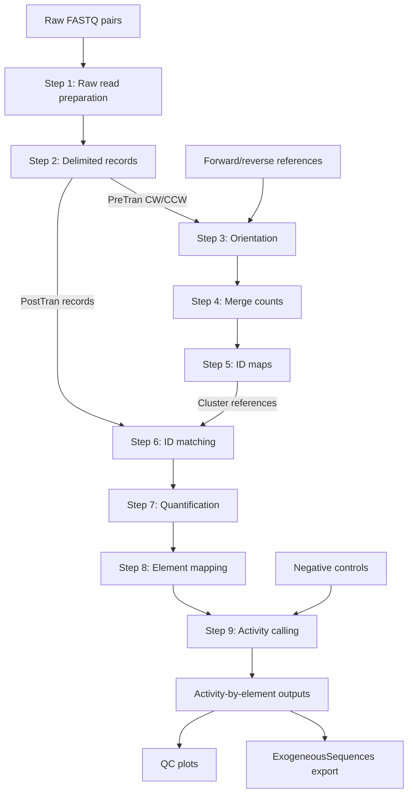

# Workflow

The pipeline starts from raw FASTQ pairs for pre-transfection and
post-transfection libraries. It trims and parses reads, builds pre-transfection
ID maps, matches post-transfection barcode observations back to those maps,
aggregates element counts, and calls activity from RNA/DNA signal.

Read-only QC plots and ExogeneousSequences export consume pipeline outputs; they
do not modify upstream artifacts.

## Diagram

## Stages and default paths

Default work directories sit under `<project-dir>/work/` (cwd when `--project-dir` is omitted).

| Stage | Input | Main output |
| --- | --- | --- |
| 1 | Raw R1/R2 FASTQ | Trimmed FASTQ under `work/trimmed/` |
| 2 | Trimmed FASTQ + layout schema | `work/delimited/<prefix>_step2_records.tsv.gz` |
| 3 | Step 2 records + references | Orientation-resolved records under `work/pretran_orientation/` |
| 4 | CW + CCW Step 3 outputs | Pre-transfection merged counts under `work/pretran_merge_counts/` |
| 5 | Step 4 counts | Crosswalk and EID/PID cluster references under `work/id_map_generation/` |
| 6 | Post-transfection Step 2 records + cluster reference | Matched records under `work/posttran_id_matching/` |
| 7 | Step 6 matched records | Per-replicate quantification under `work/posttran_quantification/` |
| 8 | Step 7 counts + cluster reference | Element-count table under `work/posttran_element_mapping/` |
| 9 | Step 8 DNA/RNA replicate tables + negative controls | Activity-by-element table (user `--output-path`) |

Typical Step 5 retained artifacts:

- `work/id_map_generation/pretran_step5_id_crosswalk.tsv.gz`
- `work/id_map_generation/pretran_step5_eid_cluster_reference.tsv.gz`
- `work/id_map_generation/pretran_step5_pid_cluster_reference.tsv.gz`

Typical Step 8 retained artifact per replicate:

- `work/posttran_element_mapping/<prefix>_step8_element_counts.tsv.gz`

## Forward/reverse reference pairing

The forward and reverse tested-library FASTA files form a **one-to-one positional pair**:

- Both files must contain the same number of records (`N`).
- Record `i` in the forward file and record `i` in the reverse file represent the **same physical element** in opposite orientations.
- Header strings may differ (for example `1.fwd` vs `1.rev`); pairing is by **record order**, not by matching `Element` names.
- Headers must be unique within each file.

This contract is used by orientation processing, orientation-scatter QC, and ExogeneousSequences export. See [Artifact formats](formats.md).

## Dual-branch completion

A full experiment produces **two** final activity tables (one per barcode branch):

| Branch | Typical cluster reference | Typical output |
| --- | --- | --- |
| eBC | `pretran_step5_eid_cluster_reference.tsv.gz` | `EID-ActivityByElement.tsv.gz` |
| pBC | `pretran_step5_pid_cluster_reference.tsv.gz` | `PID-ActivityByElement.tsv.gz` |

Run `process_posttrans` once per replicate with the matching branch cluster reference, then run `call_activity` once per branch.

## Grouped commands

Most users run the four grouped orchestration commands rather than individual steps:

| Command | Steps | Purpose |
| --- | --- | --- |
| `prep_lib` | 1 → 2 | Trim + delimited records (once per library) |
| `process_pretrans` | 3 → 4 → 5 | Pre-transfection processing + ID maps (once) |
| `process_posttrans` | 6 → 7 → 8 | One post-transfection replicate |
| `call_activity` | 9 | Activity calling (once per branch) |

Grouped commands wire step-to-step intermediates automatically. By default they
delete orchestrator-managed intermediates after success while retaining final
outputs and `*_summary.json` files. Pass `--no-delete-intermediate` to keep
intermediates. Details and examples: [Pipeline CLI](cli/pipe.md).
